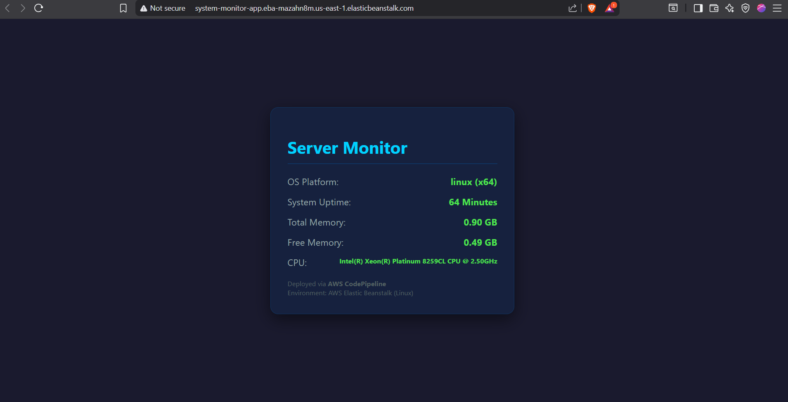
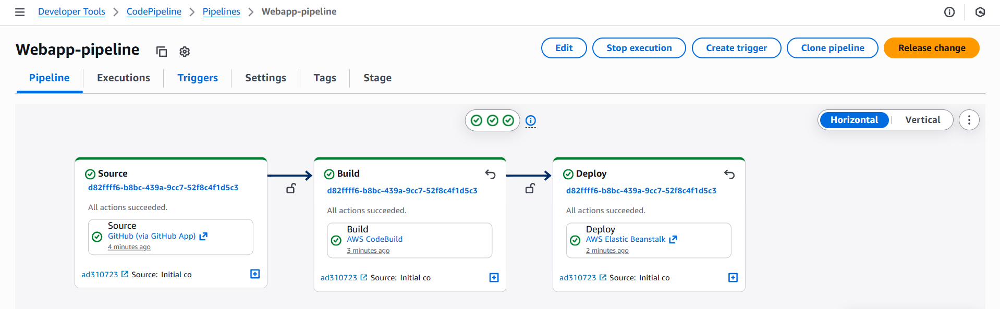

# AWS CI/CD System Health Dashboard

A functional DevOps project demonstrating a fully automated CI/CD pipeline.

## Features
- **Real-time Monitoring:** Displays Linux system metrics (Uptime, RAM, CPU).
- **Automation:** Fully integrated with AWS CodePipeline.
- **Infrastructure:** Hosted on AWS Elastic Beanstalk (Amazon Linux).

## Architecture
- **Source:** GitHub
- **Build:** AWS CodeBuild
- **Deploy:** AWS Elastic Beanstalk
- **Runtime:** Node.js

## 📸 Proof of Success
### Live Dashboard

### CI/CD Pipeline Status

## 📖 How it Works
Every time I push code to the `main` branch, CodePipeline triggers a build via CodeBuild and deploys the update to the Elastic Beanstalk environment automatically.
